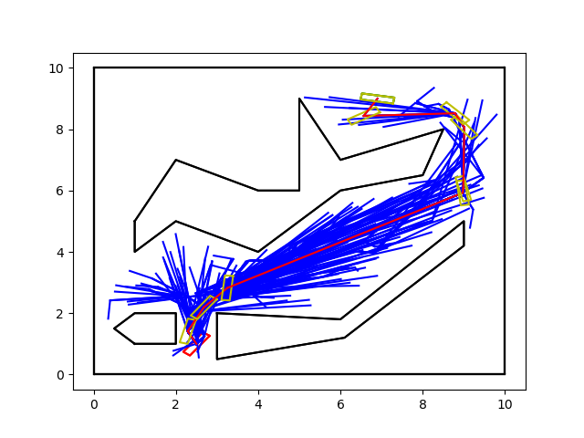
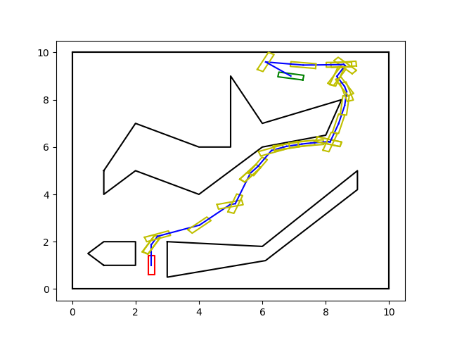

# Sampling-Based Motion Planning: RRT and RRT*
### Folder 1: 2D Geometric Motion Planning

### Folder 2: Geometric Motion Planning for a Car

### Folder 3: Kinematic Motion Planning for a Holonomic Car

### Folder 4: Kinodynamic Motion Planning for a Non-holonomic Car

### Folder 5: Kinodynamic Motion Planning for a Four-Wheel Non-holonomic Car

